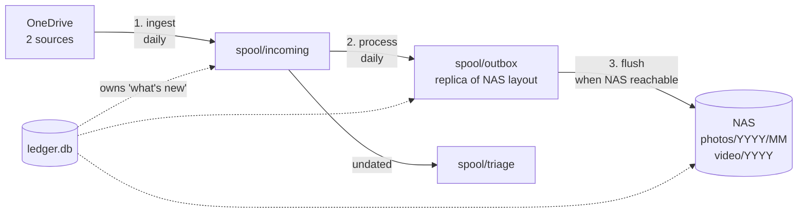

# photocopier

Moves photos and video from OneDrive camera uploads into a NAS library organized as
`photos/YYYY/MM/` and `video/YYYY/` — automatically, daily, and correctly even when the
NAS has been unreachable for three weeks.

> **Status: phases 0–1 complete.** `doctor`, `ingest`, and `status` work, with 130 tests
> passing on macOS and Linux. Files land in the spool; nothing is filed or delivered to
> the NAS yet — that is phases 2 and 3. The roadmap below is honest about what exists.

---

## The problem

Two phones upload continuously to OneDrive. The permanent home is a 14 TB NAS with a
folder convention maintained since 2000. Nothing connects them, so the gap gets closed by
hand — download, work out what's already filed, rename per phone, sort into year and
month, copy, verify, delete.

**About two hours a month.** Roughly a day a year, spent dragging JPEGs.

Worse, the manual process stops entirely during travel, which is precisely when the most
photos get taken, and resumes against a backlog large enough to discourage starting.

## How it works

Ingest and delivery are decoupled by a durable spool, so the NAS being unreachable never
stops photos from coming down.



The outbox is a **byte-exact replica** of what will land on the NAS, so delivery is a
dumb verified move with no business logic, and you can inspect exactly what's about to
happen before it happens.

## Three decisions worth reading

**Measured before optimizing, then didn't optimize.**
The spool means every byte crosses the wire twice. Before building an adaptive path that
would stream directly when home, the actual volumes got measured: ~2 GB/month against
264 GB free. The "waste" is seconds per month over a LAN. The optimization would have
doubled the code paths to save nothing. → [D3](docs/decisions.md#d3--no-adaptive-dual-path-transfer)

**Found the flaw that would have made it re-download everything, daily.**
rclone decides what to copy by comparing source to destination. The spool gets emptied
after delivery — so the next run sees an empty destination and re-downloads the entire
library. Caught in design review. Fixed by moving the "what's new" decision into a ledger
that survives the flush. → [D1](docs/decisions.md#d1--rclone-is-a-transfer-engine-not-a-sync-engine)

**Refused a data source that would have answered every question.**
File mtime always exists and would give every photo a date. It's excluded, because
OneDrive and rclone rewrite it — so it reflects when the file moved, not when the photo
was taken. A confidently wrong date is worse than no date: wrong dates file silently into
the wrong month, while missing dates route to triage where a human looks at them.
→ [D4](docs/decisions.md#d4--file-mtime-is-excluded-from-date-resolution)

The [full decision log](docs/decisions.md) includes the reversals, which are the useful ones.

## Success metrics

Computed from the ledger by `photocopier status` — instrumented, not aspirational.

| Metric | Baseline | Target |
|---|---|---|
| Manual minutes per month | ~120 | 0 |
| Files delivered without intervention | — | ≥ 99% |
| Files requiring triage | — | < 1% |
| **Files lost, overwritten, or misfiled** | — | **0 — invariant** |
| Longest unattended streak | 0 days | tracked |

## Roadmap

| Phase | Deliverable | State |
|---|---|---|
| 0 | Repo, config loader, `doctor` | ✅ |
| 1 | Ledger + `ingest` | ✅ |
| 2 | `process` — dates, layout, naming, triage | ☐ |
| 3 | `flush` — guards, verified delivery | ☐ |
| 4 | Scheduling, full `status` metrics, initial backfill | ☐ |
| 5 | Port to run on the NAS directly | ☐ |

Phase 3 is the line where this stops being a staging tool and starts filing photos.

## Usage

```bash
photocopier doctor              # check environment and configuration
photocopier ingest --dry-run    # report what would come down
photocopier ingest              # fetch new files into the spool
photocopier status              # spool usage and ledger state
```

A run, with two phones configured:

```
$ photocopier ingest
phone-1: ingested 4 file(s), 4.7 MB
    (5 seen, 0 already in ledger, 0 before cutoff, 1 junk)
phone-2: ingested 2 file(s), 341.8 KB
    (2 seen, 0 already in ledger, 0 before cutoff, 0 junk)

total: ingested 6 file(s), 5.0 MB
spool: 5.0 MB of 20.0 GB used
```

The same command a minute later — the ledger, not the spool, is what remembers:

```
$ photocopier ingest
phone-1: ingested 0 file(s), 0 B
    (5 seen, 4 already in ledger, 0 before cutoff, 1 junk)
phone-2: ingested 0 file(s), 0 B
    (2 seen, 2 already in ledger, 0 before cutoff, 0 junk)

total: ingested 0 file(s), 0 B
```

`doctor` is deliberately blunt about the failure mode that matters most:

```
$ photocopier doctor
[ok  ] config: loaded /Users/you/.config/photocopier/config.toml
[ok  ] spool: /Users/you/.local/share/photocopier/spool (5.0 MB of 20.0 GB used)
[ok  ] rclone: rclone v1.68.2
[ok  ] remote: 'onedrive' is configured
[ok  ] sources: phone-1 -> 'Camera Roll', phone-2 -> 'Pictures/Camera Roll'
[warn] destination: /Volumes/media exists but is not a mount point — the share is not
       mounted. Delivering now would write to the local disk and look like success.
```

## Install

```bash
uv pip install -e ".[dev]"
cp config.example.toml config.toml    # then edit
```

Requires Python 3.11+ and [rclone](https://rclone.org/install/) with a OneDrive remote
configured via `rclone config`. Credentials live in rclone's own config; photocopier
never reads or stores them.

## Configuration

Adding a phone is a config block, not a code change.

```toml
[spool]
path   = "~/.local/share/photocopier/spool"   # $PHOTOCOPIER_SPOOL wins
cap_gb = 20

[destination]
photos_root  = "/Volumes/media/photos"        # YYYY/MM
video_root   = "/Volumes/media/video"         # YYYY, flat
mount_point  = "/Volumes/media"
mount_marker = ".photocopier-marker"

[[source]]
id     = "phone-1"
path   = "Camera Roll"
suffix = "phone-1"
cutoff = "2026-01-01"
```

See [`config.example.toml`](config.example.toml) for the full schema.

## Testing

```bash
pytest -q        # 130 tests, ~15s, no network and no credentials
```

A stub `rclone` stands in for the real binary and serves a fixture tree, so the whole
pipeline runs hermetically. CI covers Python 3.11–3.13 on macOS and Linux.

The tests that matter most:

- `test_emptied_spool_does_not_trigger_redownload` — the regression the ledger exists to
  prevent. Delivery empties the spool; the next run must not treat that as a fresh start
- `test_unmounted_share_is_refused` — when the share is gone, the mount point still exists
  as an empty local directory, and a naive delivery would write the backlog to the boot
  disk and report success
- `test_failed_items_are_offered_again` — a failed transfer must not count as done. Added
  after this was found to be wrong: failed items were being skipped permanently
- `test_undatable_files_survive_the_cutoff` — a file we cannot date is never silently
  excluded; it comes down and reaches triage
- `test_landed_files_are_recorded_and_the_rest_retried` — a transfer that dies midway
  keeps what it got and retries the rest

Two bugs were found by the tests and the smoke run rather than by review: failed items
being treated as already-ingested, and an `AttributeError` in the output path that every
unit test missed because nothing exercised the reporting code. Both now have tests.

## Documentation

| | |
|---|---|
| [PRD](docs/PRD.md) | Problem, goals, non-goals, metrics, requirements, risks |
| [Design](docs/design.md) | Architecture, ledger schema, guards, test plan, build order |
| [Decision log](docs/decisions.md) | Eight decisions with the evidence behind them |
| [PRFAQ](docs/PRFAQ.md) | A parody. The format, played straight, about copying photos. |

## On AI assistance

Built with Claude Code, and worth being specific about how — "AI-assisted" currently
covers everything from autocomplete to hitting enter on a prompt and shipping the output.

The effort here went overwhelmingly into planning, on purpose. Before any architecture
existed:

- **Design started with questions, not a prompt.** Four of them, about account topology,
  hosting, merge strategy, and what happens to the source files. Every answer changed the
  structure — the [requirements discovery table](docs/PRD.md#6-requirements-discovery)
  records which changed what.
- **The filesystem got measured before it got designed for.** Actual monthly volumes,
  actual free space, the existing folder conventions, and the discovery that OneDrive
  files on macOS are dataless placeholders that download implicitly when read. Two
  architecture decisions turned directly on those numbers.
- **The architecture changed twice under review.** Direct-to-NAS became a spool once the
  travel constraint surfaced. The first version of the spool had a flaw that would have
  re-downloaded the library daily, found by working through what happens on the second run.

Division of labor, honestly: the problem, the constraints, the travel requirement, the
filing conventions, and the spool architecture are mine. The flaw in my first version of
the spool was caught in review with Claude, as were the mtime trap and the unmounted-share
failure mode. The implementation will be largely AI-written against the design in these
documents.

The part I think actually matters: an AI will build whatever you ask for, quickly and
without complaint. The work is knowing what to ask for, and noticing when the answer that
comes back is wrong.

## License

MIT — see [LICENSE](LICENSE).
